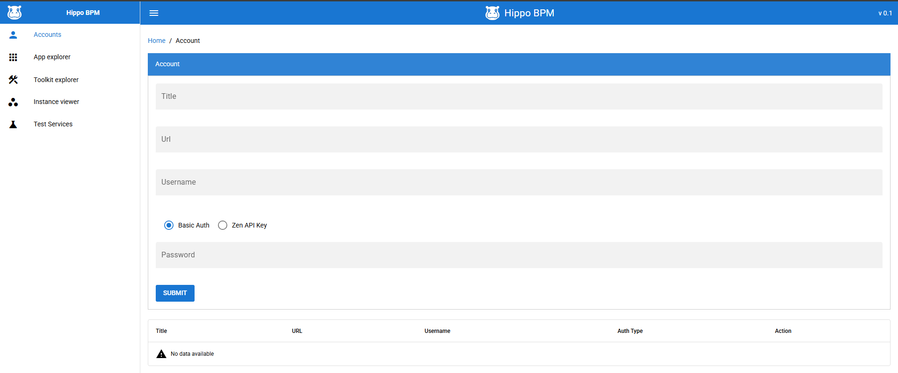

## Hi there 👋

I build developer tools and BPM/workflow tooling. A tour of my projects is below.

- 💬 Ask me about: just do random projects
- 📫 Reach me: vivek13186@gmail.com

---

## 🚀 Applications

### [nbt](https://github.com/vivekg13186/nbt)

NBT (Node Based Tester) — a web-based visual node editor for building, saving and running test flows, with a CLI, a VS Code extension, fan-out, triggers and cron scheduling. — *Python · React · FastAPI · SQLite*

---

### 🌼 [daisy-engine](https://github.com/daisy-workflow/daisy-engine) — AI orchestration platform 

Daisy AI Orchestrator is an AI orchestration platform built around a visual editor and a typed DSL. The runtime executes directed acyclic graphs (DAGs) of plugin actions with parallel execution, retries and batch fan-out, evaluates FEEL expressions, protects credentials with KMS envelope encryption, and ships OIDC auth plus audit/observability signals. One-command Docker Compose quick start.

🔗 [Repository](https://github.com/daisy-workflow/daisy-engine) · 📖 [Wiki](https://github.com/daisy-workflow/daisy-engine/wiki) — *JavaScript · Vue · Docker*

### [shuttle](https://github.com/vivekg13186/shuttle)

Runs plain JavaScript on the Duktape engine, adding a batteries-included standard library — file I/O, shell, HTTP, SQLite, HTML/XML, CSV, crypto, images/OCR — borrowed from the `z` language. — *C · JavaScript*

### [z-lang](https://github.com/vivekg13186/z-lang)

`z` — a tiny (<5 MB) Lisp-flavoured scripting language and tree-walking interpreter in single-file C99, with a rich stdlib and a notebook-style enhanced REPL (`zide`). Builds on macOS, Linux and Windows. — *C*

### [notepad](https://github.com/vivekg13186/notepad)

A lightweight, keyboard-first desktop text editor with NeoVim-style modal editing, TextMate syntax highlighting, and JSON-based themes and snippets. — *C · Raylib*

### [sparrow](https://github.com/vivekg13186/sparrow) — smart code editor

A lightweight desktop notepad with multi-tab editing, Markdown/CSV/image preview, built-in terminals, an HTTP client, a Git browser and AI assist. — *Tauri · Vue · Monaco · Rust*

⬇️ [Download](https://github.com/vivekg13186/sparrow/releases/latest)

### [rulez](https://github.com/vivekg13186/rulez)

A compact, dependency-free rule engine that runs in the browser — JSON-style rule tables, Rete-like evaluation, caching and execution tracing. — *JavaScript*

---

## 🏆 Hackathon Projects

Built for the **Build Small Hackathon** — small models doing real work, fully offline where possible.

### 💊 [PillPal](https://github.com/vivekg13186/pillpal)

Photograph a pill bottle and get a clear daily medication schedule plus a refill alert. A **MiniCPM-V** vision model reads the label into JSON; all the trust-critical scheduling and run-out math is deterministic, testable Python. *(Backyard AI track.)* — *Python · Gradio · MiniCPM-V*

▶️ [Live demo](https://huggingface.co/spaces/build-small-hackathon/pillpal) · 🔗 [Repository](https://github.com/vivekg13186/pillpal) · 🎬 [Video](https://youtu.be/Qx64AinZyKM)

### 🔮 [The Oracle](https://github.com/vivekg13186/oracle)

An Akinator-style guessing game — think of an animal, fruit, or vegetable and the Oracle narrows it down with yes/no questions. A deterministic engine does the deduction over an attribute database while a tiny **Llama 3.2** model only phrases the questions, so it runs fully offline. *(Thousand Token Wood track.)* — *Python · Gradio · llama.cpp*

▶️ [Live demo](https://huggingface.co/spaces/build-small-hackathon/oracle) · 🔗 [Repository](https://github.com/vivekg13186/oracle) · 🎬 [Video](https://youtu.be/U5UNzHBfJ1k)

### 🌳 [Heartwood](https://github.com/vivekg13186/heartwood)

A cozy pixel village where a tiny **Llama 3.2 1B** model is the game master. Each villager guards a treasure and wants something from the heart — cheer me up, flatter me, make me laugh — and you win them over in free text while the model judges, in character, whether you succeeded. Deterministic game state, LLM language and judgement; runs offline. *(Thousand Token Wood track.)* — *JavaScript · Python · Phaser · llama.cpp*

▶️ [Live demo](https://huggingface.co/spaces/build-small-hackathon/heartwood) · 🔗 [Repository](https://github.com/vivekg13186/heartwood) · 🎬 [Video](https://youtu.be/BjoZKTrLSNU)

---

## 📦 Archived Projects

### [hippo-bpm](https://github.com/vivekg13186/hippo-bpm)

Hippo DevTools — an all-in-one desktop app for developing, testing and managing IBM BAW apps (traditional & Cloud Pak): snapshots, toolkit dependencies, test services and multi-environment comparison. — *Go · Wails · JavaScript*

⬇️ [Download](https://github.com/vivekg13186/hippo-bpm/releases/latest)

### [logster](https://github.com/vivekg13186/logster)

A lightweight desktop log viewer for indexing and searching across multiple log files — timestamp-based search, custom date formats and log-level filtering. Inspired by glogg and Splunk. — *Java*

⬇️ [Download](https://github.com/vivekg13186/logster/releases/latest)

### [block-cad-desktop](https://github.com/vivekg13186/block-cad-desktop)

A Scratch-style block-programming 3D modelling app, designed to simplify 3D modelling for 3D printing. — *Desktop app*

⬇️ [Download on itch.io](https://vkgames82.itch.io/block-cad)

---

### More archived projects

| Project | Summary | Built with |
| --- | --- | --- |
| **[vs-code-plugin-for-IBM-BAW](https://github.com/vivekg13186/vs-code-plugin-for-IBM-BAW)** | A VS Code plugin to manage IBM Business Automation Workflow (BAW) environments — snapshot management/comparison, process-instance inspection, bulk actions and REST-based unit tests. *(Superseded by hippo-bpm.)* [⬇️ Download](https://marketplace.visualstudio.com/items?itemName=vivekopd.baw-app-support) | VS Code extension |
| **[otter-http-client](https://github.com/vivekg13186/otter-http-client)** | A VS Code extension HTTP/REST client. [⬇️ Download](https://marketplace.visualstudio.com/items?itemName=vivekopd.vscode-otter-http-client) | VS Code extension |
| **[baw_dev_tools](https://github.com/vivekg13186/baw_dev_tools)** | A browser-based developer tool for IBM BAW: view apps/toolkits/snapshots, manage snapshot states in bulk, inspect dependencies and config, and run Groovy-based unit tests. | Java · GraphQL |
| **[bpm_util](https://github.com/vivekg13186/bpm_util)** | A GUI tool to view application environment variables from IBM BPM TWX files. | Java |
| **[sonarqube-bpmn-plugin](https://github.com/vivekg13186/sonarqube-bpmn-plugin)** | A SonarQube plugin that adds analysis for Camunda `.bpmn` files, porting bpmnlint's rule set. | Java |
| **[cucumber-camunda-js](https://github.com/vivekg13186/cucumber-camunda-js)** | A Cucumber-based testing framework for Camunda — deploy BPMN/DMN, drive user tasks, and evaluate decision tables (including Excel inputs), across cloud, docker and local setups. | JavaScript |
| **[Haver](https://github.com/vivekg13186/Haver)** | A microflow engine that ingests a JSON workflow definition (Start / End / Command / Condition steps) and executes it, emitting events. | Java |
| **[easy_web_crawler](https://github.com/vivekg13186/easy_web_crawler)** | A Node.js web crawler built on Puppeteer for JavaScript/AJAX pages, with URL filtering, deduplication, stop/resume support and fast image download. | JavaScript · Puppeteer |
| **[lumino_js_starter_template](https://github.com/vivekg13186/lumino_js_starter_template)** | A starter template for Lumino.js apps (dock panels, TypeScript, Parcel) with ready-made widgets — dev console, Tabulator grid, toolbar, BPMN and code editors, and a status bar. | TypeScript · Lumino |
| **[vscode_tabluator_css](https://github.com/vivekg13186/vscode_tabluator_css)** | A Tabulator CSS theme for styling grids inside VS Code webview widgets. | CSS |
| **[JavaBusinessCalendar](https://github.com/vivekg13186/JavaBusinessCalendar)** | A Java business-calendar library (based on jBPM's) for holiday and working-hour checks plus date/timezone helpers. | Java |
| **[Snake-Game](https://github.com/vivekg13186/Snake-Game)** | A classic Snake game with Marathon and Sprint modes; released on itch.io. | Python · pygame |
| **[casper](https://github.com/vivekg13186/casper)** | A Java project automatically exported from Google Code (code.google.com/p/casper). | Java |
